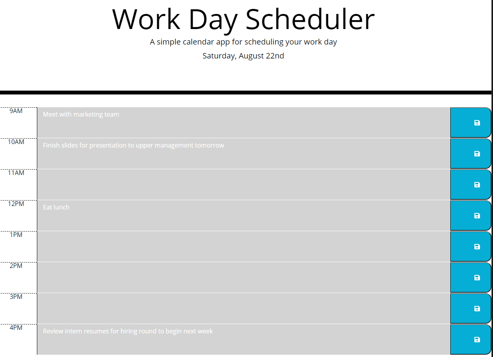

# Day Scheduler

This is a work simple work scheduler that I created to allow the user to plan out their day and schedule events during the workday.  This scheduler assumes a work day from 9 to 5.  

## Features
This application has a number of features, including:

1. Current date is displayed in the header.
2. Each row has a time display, input box for reminders and a save button.
3.  The input boxes will be highlight depending on what the current time is.
    - The box will be gray if it is in the past
    - It will be red if the current time falls within that block of time
    - Future time blocks will be highlighted green.
    - The highlighting will update every time the page is refreshed.\
4. There is a save button to save the event in memory.  This will be stored even if the page is refreshed.
 

Click to navigate to the [work day scheduler](https://jburz.github.io/work-day-scheduler)

## Screenshot

## Tools

The layout and design for this app uses the css framework [bootstrap](https://getbootstrap.com/docs/4.5/getting-started/introduction/) as well as some custom styling.

All of the date and time formatting and display was done with [moment.js](https://momentjs.com/).

I really tried to focus on eliminating repetition and keep the javascript code as dry as possible within this app.

## Credits

This app was created entirely by [Jake Burzlaff](https://www.github.com/jburz).